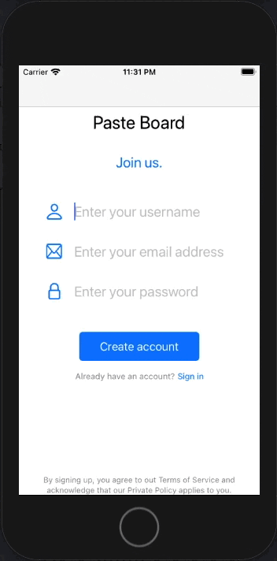

# Login Page using AWS Cognito


This project is an example of using `AWS cognito` and `coordinator pattern` to create a login page. 

## Features 

- Sign up 
- Sign in 



## Requirements

- iOS 14.1+
- Swift 5.0+
- Swift packages: UtilityKit 1.0.1
- Cocoapods: Amplify, AmplifyPlugins/AWSCognitoAuthPlugin

#### Swift Package Manager

- File > Swift Packages > Add Package Dependency
- Add `https://github.com/darrylweimers/UtilityKit`
- Select "Up to Next Major" with "1.0.1"

#### Cocoapod
```ruby
# Uncomment the next line to define a global platform for your project
platform :ios, '14.0'

target 'amplify-auth-getting-started' do
  # Comment the next line if you don't want to use dynamic frameworks
  use_frameworks!

  # Pods for amplify-auth-getting-started
  pod 'Amplify'
  pod 'AmplifyPlugins/AWSCognitoAuthPlugin'

  target 'amplify-auth-getting-startedTests' do
    inherit! :search_paths
    # Pods for testing
  end

  target 'amplify-auth-getting-startedUITests' do
    # Pods for testing
  end

end
```

## Credits

- Darryl Weimers
